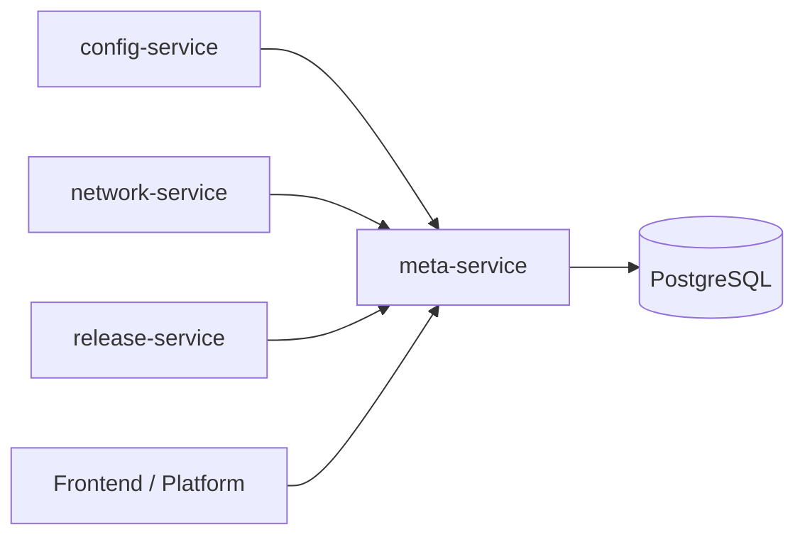

# Meta Service

## Purpose

`meta-service` is the current active service being migrated into the root `devflow-service` layout.

It is the system metadata authority for the platform control plane.
Other services should not own duplicate truth for application, environment, cluster, or application-environment binding metadata.

## Owns

- `Project`
- `Application`
- `ApplicationEnvironment`
- `Cluster`
- `Environment`

## Does Not Own

- `AppConfig`
- `WorkloadConfig`
- `Service`
- `Route`
- `Manifest`
- `Image`
- `Release`
- `Intent`
- `RuntimeSpec`
- `RuntimeSpecRevision`
- `RuntimeObservedPod`
- `RuntimeOperation`

## Dependency model

### Upstream dependencies

- PostgreSQL
- shared backend primitives

### Downstream service consumers

- `config-service`
  - validates and resolves application context for app config and workload config ownership
- `network-service`
  - validates and resolves application context for service and route ownership
- `release-service`
  - resolves application projection during manifest creation
  - resolves application / environment / cluster deploy target during release creation and deployment
- frontend and platform orchestration layers

## What meta-service provides to other services

### To config-service

`meta-service` provides the metadata context needed to answer questions such as:

- does this application exist
- which project owns this application
- which environments are bound to this application

`config-service` still owns config truth.
`meta-service` only provides the metadata boundary.

### To network-service

`meta-service` provides the metadata context needed to answer questions such as:

- does this application exist
- which application-environment binding is valid
- which environment identifier is being referenced

`network-service` still owns network truth.
`meta-service` only provides the metadata boundary.

### To release-service

`meta-service` provides the metadata context needed to answer questions such as:

- what is the application name
- what repository is associated with the application
- which environment is being targeted
- which cluster is associated with that environment
- what namespace or deploy target should be used

`release-service` then combines that metadata with config and network truth from other services and freezes it into release-owned records.

## Dependency view



### Notes

- `meta-service` is the metadata authority for application, environment, cluster, and binding truth
- `config-service`, `network-service`, and `release-service` consume metadata from `meta-service` but should not duplicate ownership
- `meta-service` does not execute builds or deployments

## What meta-service does not do

`meta-service` should not:

- own application configuration files
- own workload runtime shape
- own service ports or routes
- own build records
- own release records
- own live pod inspection or rollout operations
- render deployment bundles

That separation is important because `meta-service` is the metadata source of truth, not the deployment executor.

## Entrypoint

Primary runnable entrypoint: `cmd/meta-service/main.go`.

```text
cmd/meta-service/main.go
```

## Registered Domains

```text
internal/project/
internal/application/
internal/applicationenv/
internal/cluster/
internal/environment/
```

## Pre-production Shared Ingress

- `/api/v1/meta/...`

## Resource Contracts

- `docs/resources/project.md`
- `docs/resources/application.md`
- `docs/resources/application-environment.md`
- `docs/resources/cluster.md`
- `docs/resources/environment.md`

## Diagnostics

- `AGENTS.md`
- `internal/platform/...`
- `docs/system/recovery.md`
- `docs/system/architecture.md`
- `docs/system/diagrams.md`
- `docs/policies/verification.md`
- `scripts/README.md`

Runtime endpoints:

- `/healthz`
- `/readyz`
- `/internal/status`

## Verification

```sh
go test ./...
go build -o bin/meta-service ./cmd/meta-service
bash scripts/verify.sh
```
