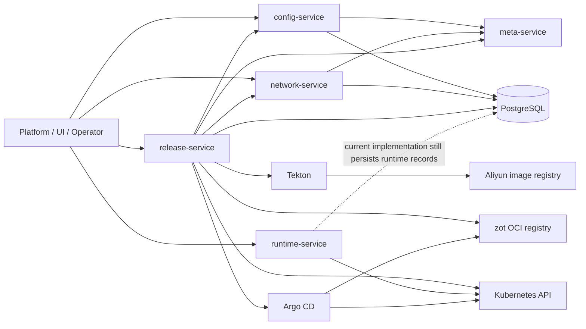
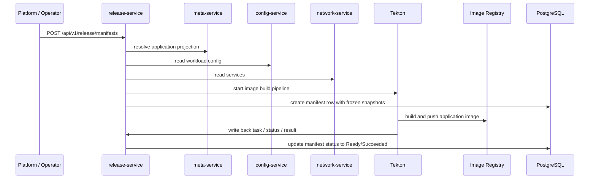
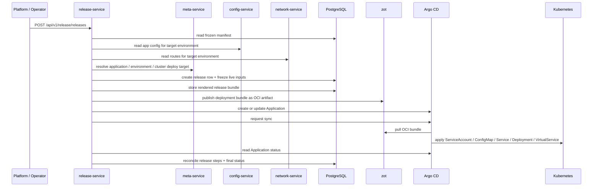
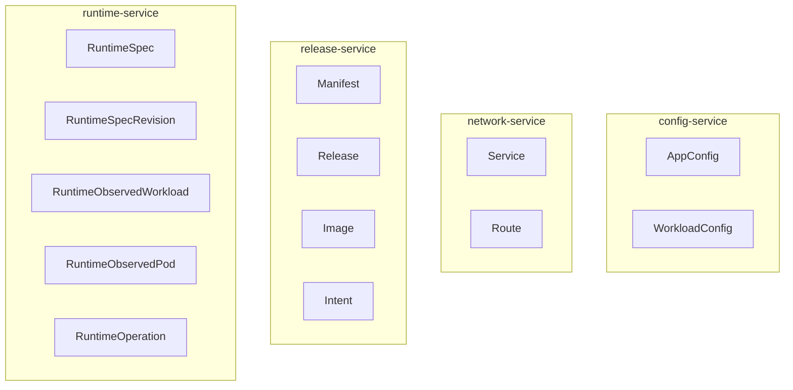
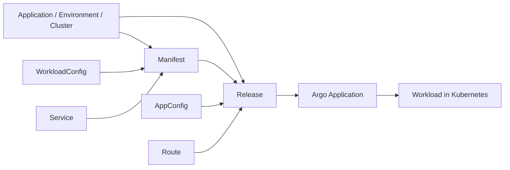

# Diagrams

## Purpose

This document provides visual repo-local diagrams for the current DevFlow backend runtime shape.
It is visualization support for the active local contract, not a replacement for the owning resource or service docs.

Use these diagrams when you need to explain:

- service-to-service dependencies
- `Manifest` and `Release` execution flow
- resource ownership boundaries

## 1. Service dependency diagram

### Notes

- `config-service` owns `AppConfig` and `WorkloadConfig`
- `network-service` owns `Service` and `Route`
- `release-service` owns `Manifest`, `Release`, `Image`, and `Intent`
- `runtime-service` owns runtime inspection and runtime operations
- `release-service` is the main cross-service composer: it reads application / environment / cluster metadata from `meta-service`, workload and app config from `config-service`, and network topology from `network-service`
- `runtime-service` should be understood as Kubernetes-first; current code still contains runtime persistence in PostgreSQL, but pod listing / pod delete / rollout restart are Kubernetes-driven operations

## 2. Manifest build sequence diagram

### Notes

- `Manifest` is the release-owned durable build record
- its frozen inputs come from `meta-service`, `config-service`, and `network-service`
- Tekton produces the image result, but the durable system record lives on the manifest row

## 3. Release deploy sequence diagram

### Current release stages

For normal rolling release, the key steps are:

1. `freeze_inputs`
2. `render_deployment_bundle`
3. `publish_bundle`
4. `create_argocd_application`
5. `start_deployment`
6. `observe_rollout`
7. `finalize_release`

See also:

- `docs/system/release-steps.md`
- `docs/system/release-writeback.md`

## 4. Resource ownership diagram

### Ownership rules

- one resource belongs to one service only
- `Manifest` and `Release` are release-owned resources
- `Service` and `Route` are network-owned resources
- `AppConfig` is config-owned and is consumed by release at freeze time
- runtime data is runtime-owned even when release reads deployment health indirectly through Argo

## 5. Cross-service resource dependency view

### Notes

- `Manifest` freezes application metadata, workload config, and service snapshot for build-time and later deploy-time consumption
- `Release` freezes app config and route snapshot at release time, then resolves the final deploy target from meta-service
- Argo deploys the release-generated bundle, not the original Git config repo directly
- runtime pod inspection and runtime operations act on live Kubernetes workloads rather than reading release state from PostgreSQL first
- runtime workload overview and pod display both prefer runtime-owned observed index data

## Source pointers

- service ownership: `docs/services/`
- resource ownership: `docs/resources/`
- current repo shape: `docs/system/architecture.md`
- release writeback: `docs/system/release-writeback.md`
- release steps: `docs/system/release-steps.md`
