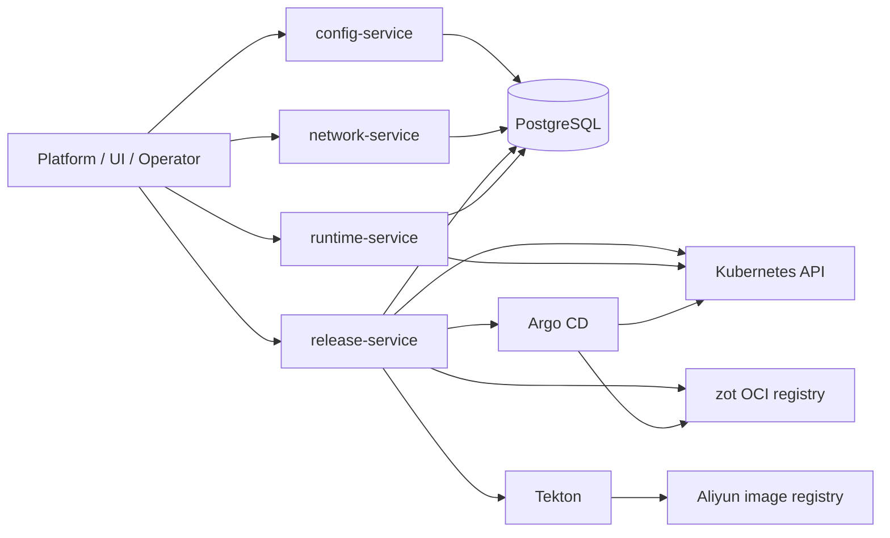
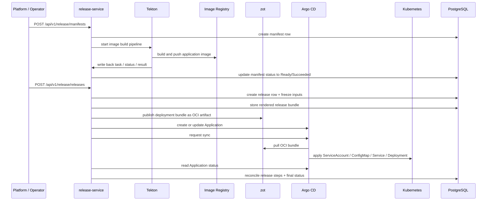
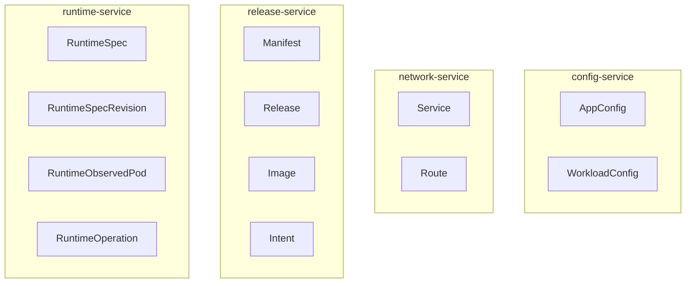
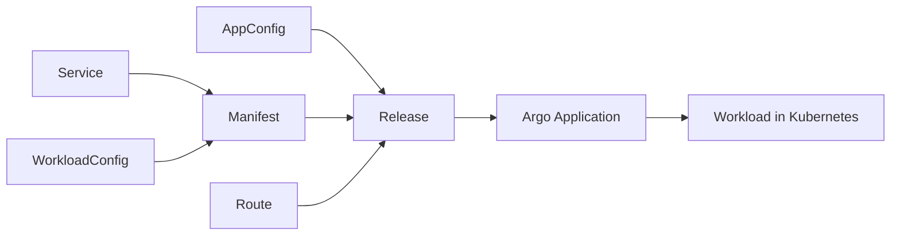

# Diagrams

## Purpose

This document provides visual repo-local diagrams for the current DevFlow backend runtime shape.
It is visualization support for the active local contract, not a replacement for the owning resource or service docs.

Use these diagrams when you need to explain:

- service-to-service dependencies
- `Manifest` and `Release` execution flow
- resource ownership boundaries

## 1. Service dependency diagram

### Notes

- `config-service` owns `AppConfig` and `WorkloadConfig`
- `network-service` owns `Service` and `Route`
- `release-service` owns `Manifest`, `Release`, `Image`, and `Intent`
- `runtime-service` owns runtime inspection and runtime operations
- all four services currently depend on the shared PostgreSQL cluster

## 2. Manifest / Release sequence diagram

### Current release stages

For normal rolling release, the key steps are:

1. `freeze_inputs`
2. `render_deployment_bundle`
3. `publish_bundle`
4. `create_argocd_application`
5. `start_deployment`
6. `observe_rollout`
7. `finalize_release`

See also:

- `docs/system/release-steps.md`
- `docs/system/release-writeback.md`

## 3. Resource ownership diagram

### Ownership rules

- one resource belongs to one service only
- `Manifest` and `Release` are release-owned resources
- `Service` and `Route` are network-owned resources
- `AppConfig` is config-owned and is consumed by release at freeze time
- runtime data is runtime-owned even when release reads deployment health indirectly through Argo

## 4. Cross-service resource dependency view

### Notes

- `Manifest` freezes workload and service snapshot
- `Release` freezes app config and route snapshot at release time
- Argo deploys the release-generated bundle, not the original Git config repo directly

## Source pointers

- service ownership: `docs/services/`
- resource ownership: `docs/resources/`
- current repo shape: `docs/system/architecture.md`
- release writeback: `docs/system/release-writeback.md`
- release steps: `docs/system/release-steps.md`
