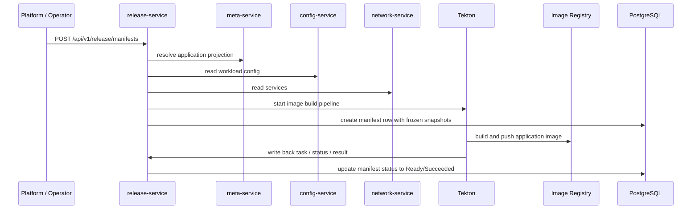
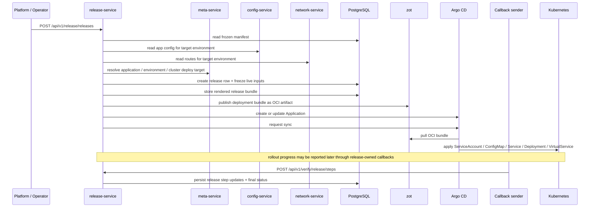

# Release flow diagrams

## Manifest build sequence diagram

## Notes

- `Manifest` is the release-owned durable build record
- frozen inputs come from `meta-service`, `config-service`, and `network-service`
- Tekton produces the image result, but the durable system record lives on the manifest row

## Release deploy sequence diagram

## Current release stages

1. `freeze_inputs`
2. `ensure_namespace`
3. `ensure_pull_secret`
4. `ensure_appproject_destination`
5. `render_deployment_bundle`
6. `publish_bundle`
7. `create_argocd_application`
8. `start_deployment`
9. `observe_rollout`
10. `finalize_release`

See also:

- `docs/system/release-steps.md`
- `docs/system/release-writeback.md`

## Boundary note

- `release-service` starts deployment by creating/updating the Argo CD `Application`
- `release-service` no longer polls Argo CD application status directly during release detail reads
- rollout progress, when reported asynchronously, should come back through release-owned writeback routes
- do not read this diagram as proof that `runtime-service` currently auto-starts release rollout writeback; the in-tree rollout observer is not started by the active runtime startup path
