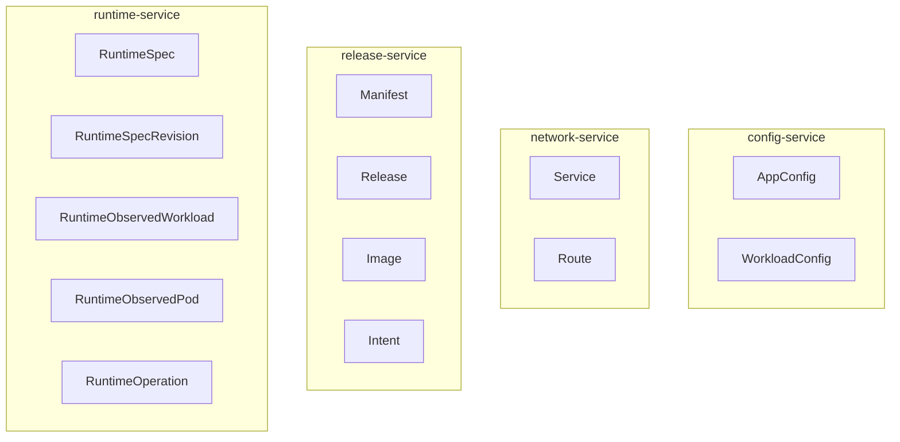
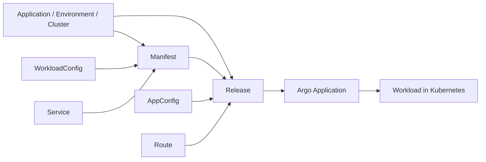

# Resource ownership diagrams

## Resource ownership diagram

## Ownership rules

- one resource belongs to one service only
- `Manifest` and `Release` are release-owned resources
- `Service` and `Route` are network-owned resources
- `AppConfig` is config-owned and is consumed by release at freeze time
- runtime data is runtime-owned even when release reads deployment health indirectly through runtime observation

## Cross-service resource dependency view

## Notes

- `Manifest` freezes application metadata, workload config, and service snapshot for build-time and later deploy-time consumption
- `Release` freezes app config and route snapshot at release time, then resolves the final deploy target from meta-service
- Argo deploys the release-generated bundle, not the original Git config repo directly
- runtime pod inspection and runtime operations act on live Kubernetes workloads
- runtime workload overview and pod display both prefer runtime-owned observed state
