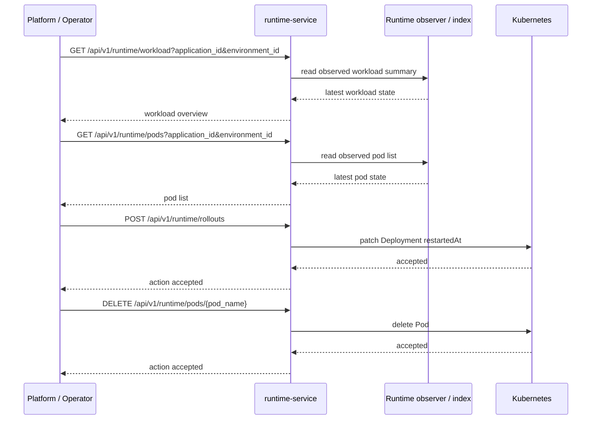

# Runtime flow diagram

## Runtime read / action sequence diagram

## Notes

- runtime reads should prefer observer/index-backed state
- runtime actions should call Kubernetes only for explicit user-triggered mutations
- after an action succeeds, the UI should refresh workload + pod reads from the runtime index
- the default runtime HTTP path is memory-backed and does not load runtime rows from PostgreSQL at startup
- runtime-service active/runtime-domain storage is PostgreSQL-free
- release rollout observation is also started by the active runtime startup path and consumes runtime observer state plus Kubernetes labels
- shared platform startup outside `cmd/runtime-service` may still open PostgreSQL for other services
- observer state is rebuilt in-process after restart from Kubernetes observations
