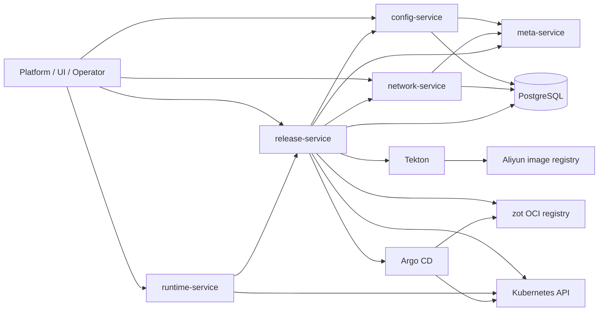

# Service dependency diagram

## Notes

- `config-service` owns `AppConfig` and `WorkloadConfig`
- `network-service` owns `Service` and `Route`
- `release-service` owns `Manifest`, `Release`, `Image`, and `Intent`
- `runtime-service` owns runtime inspection, runtime observation, and runtime operations
- `release-service` is the main cross-service composer
- `runtime-service` is Kubernetes-first for operator-facing reads/actions, with a memory-backed default HTTP path
- PostgreSQL-backed runtime repository and release-rollout observer support code still exist
