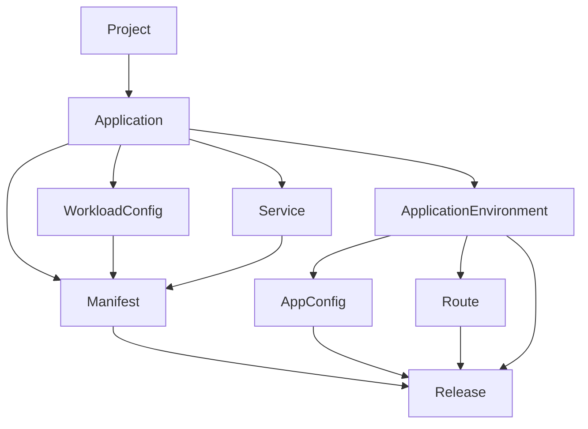

# Domain Model

## 这个文档解决什么问题

这份文档专门解释 `Project`、`Application`、`Service`、`Config`、`Manifest`、`Release` 等核心对象之间的关系。

如果你读 `README` 后还不确定：

- 哪些是应用级对象
- 哪些是环境级对象
- 为什么 `Manifest` 和 `Release` 要分开
- Overlay / EnvConfig 到底表达什么

就先看这里。

## 一张关系图

## 关系说明

### 1. `Project`

- 项目分组
- 一个 `Project` 可以有多个 `Application`

### 2. `Application`

- 应用主实体
- 关联一个 `Project`
- 连接配置、网络、构建和发布链路

### 3. `ApplicationEnvironment`

- `Application` 和 `Environment` 的绑定关系
- 用来表达“这个应用在哪些环境里存在”

### 4. `WorkloadConfig`

- 应用级 runtime 基线
- 当前是 application-scoped
- 描述副本数、资源、探针、环境变量、labels、annotations

### 5. `Service`

- 应用级网络服务定义
- 当前是 application-scoped
- 主要描述 service name 和 port 拓扑

### 6. `AppConfig`

- 环境级配置输入
- 当前按 `application_id + environment_id` 解析
- 表达配置文件和环境特定的 config data

### 7. `Route`

- 环境级入口规则
- 当前会绑定 `application_id + environment_id`
- 描述 host、path、service_name、service_port

## 为什么 `Manifest` 和 `Release` 要分开

### `Manifest`

`Manifest` 是 build-side freeze point。

它冻结：

- `application_id`
- `git_revision`
- `commit_hash`
- `services_snapshot`
- `workload_config_snapshot`

它记录：

- Tekton build 过程
- 最终镜像 `image_ref`

它不应该承载：

- 目标环境
- 环境配置
- 环境路由
- 发布 artifact

### `Release`

`Release` 是 deploy-side freeze point。

它冻结：

- `manifest_id`
- `environment_id`
- `app_config_snapshot`
- `routes_snapshot`
- `strategy`

它记录：

- 渲染后的部署 bundle
- 发布到 OCI 的 artifact 信息
- Argo CD handoff
- rollout / finalize 过程

## Manifest 的不变性

当前约定里，`Manifest` 是发布前冻结的不可变快照。

这表示：

- 它的输入快照一旦写入，就不应随着后续配置变化而回写
- Tekton status writeback 可以更新状态和步骤信息
- 但冻结输入本身不应该被新的配置覆盖

## 环境差异如何表达

当前环境差异不是通过业务代码里的 `if env == ...` 表达，而是通过 Overlay / EnvConfig 表达。

实际对应关系可以这样理解：

- `WorkloadConfig`：应用级基线
- `Service`：应用级服务拓扑
- `AppConfig`：环境级配置内容
- `Route`：环境级流量入口
- `Release` render：把这些输入在目标环境上叠加成最终部署 bundle

## 当前边界总结

- 应用级稳定输入先冻结到 `Manifest`
- 环境级差异在 `Release` 阶段叠加
- 运行时状态不回写成 `Manifest` 或 `AppConfig`
- `runtime-service` 观察运行状态，但不拥有 `Release` 真相

## 相关文档

- `docs/system/architecture.md`
- `docs/services/release-service.md`
- `docs/resources/manifest.md`
- `docs/resources/release.md`
- `docs/resources/workloadconfig.md`
- `docs/resources/appconfig.md`
